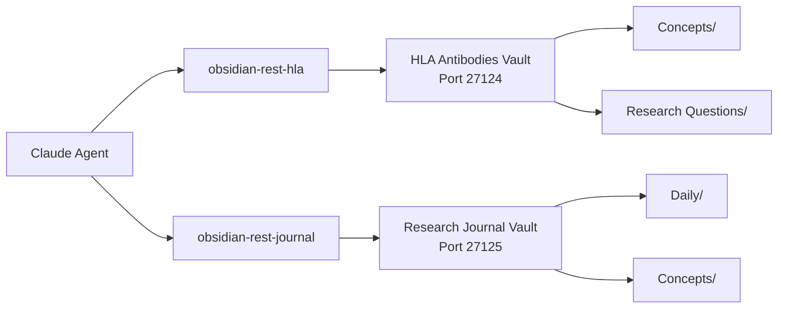

# Dual Vault Setup Guide

> Complete automation for HLA research with simultaneous access to both Obsidian vaults

## Why Dual Vault?

The dual vault setup enables the agent to:
- ✅ Write HLA concepts directly to HLA Antibodies vault
- ✅ Create daily entries in Research Journal vault
- ✅ No manual vault switching required
- ✅ Full automation of research workflow

## Prerequisites

- Two Obsidian vaults configured:
  - **HLA Antibodies** vault
  - **Research Journal** vault
- Local REST API plugin installed in BOTH vaults
- Both vaults accessible via Box Drive or iCloud

## Step-by-Step Configuration

### 1. Configure HLA Antibodies Vault

1. Open **HLA Antibodies** vault in Obsidian
2. Go to Settings → Community Plugins → Local REST API
3. Verify settings:
   - Port: **27124** (default)
   - HTTPS enabled: ✅
4. Copy the API key (starts with long alphanumeric string)
5. Keep this Obsidian window open

### 2. Configure Research Journal Vault

1. Open **Research Journal** vault in a SECOND Obsidian window
2. Go to Settings → Community Plugins → Local REST API
3. Click "Advanced Settings" at bottom
4. **CRITICAL: Change port from 27124 to 27125**
5. Copy the API key (will be different from HLA vault key)
6. Keep this Obsidian window open

### 3. Update Claude Desktop Configuration

Edit your config file:
```bash
open ~/Library/Mobile\ Documents/com~apple~CloudDocs/MCP-Shared/claude-desktop-config.json
```

Find and REPLACE the single `"obsidian-rest"` entry with these TWO entries:

```json
"obsidian-rest-hla": {
  "command": "npx",
  "args": ["dkmaker-mcp-rest-api@latest"],
  "env": {
    "REST_BASE_URL": "https://127.0.0.1:27124",
    "AUTH_BEARER": "YOUR-HLA-VAULT-API-KEY",
    "REST_ENABLE_SSL_VERIFY": "false",
    "NODE_TLS_REJECT_UNAUTHORIZED": "0"
  }
},
"obsidian-rest-journal": {
  "command": "npx",
  "args": ["dkmaker-mcp-rest-api@latest"],
  "env": {
    "REST_BASE_URL": "https://127.0.0.1:27125",
    "AUTH_BEARER": "YOUR-JOURNAL-VAULT-API-KEY",
    "REST_ENABLE_SSL_VERIFY": "false",
    "NODE_TLS_REJECT_UNAUTHORIZED": "0"
  }
}
```

Replace:
- `YOUR-HLA-VAULT-API-KEY` with the key from HLA Antibodies vault
- `YOUR-JOURNAL-VAULT-API-KEY` with the key from Research Journal vault

### 4. Restart Claude Code

```bash
claude restart
```

### 5. Verify Both Connections

In Claude Code:
```
/mcp
```

You should see:
- ✅ obsidian-rest-hla
- ✅ obsidian-rest-journal
- ✅ memory
- ✅ pubmed
- ✅ filesystem-local
- ✅ sequential-thinking

## Testing Your Setup

Ask the agent to test both vaults:
```
/agent Create a test concept about MFI cutoffs in the HLA vault and today's journal entry about setting up dual vaults
```

The agent should:
1. Create `/Concepts/MFI_Cutoffs.md` in HLA Antibodies vault
2. Create `/Daily/2025-01-20.md` in Research Journal vault
3. Both without any manual intervention

## Troubleshooting

### "Port already in use" error
- Make sure each vault uses a different port
- HLA Antibodies: 27124
- Research Journal: 27125

### Only one vault connects
- Verify both Obsidian windows are open
- Check that ports are different
- Ensure both API keys are in the config

### iCloud sync conflicts
- Always choose "Modified recently" when prompted
- Wait for full sync before testing
- Both machines will sync automatically via iCloud

## How It Works



## Benefits Over Single Vault

| Feature | Single Vault | Dual Vault |
|---------|-------------|------------|
| Simultaneous access | ❌ | ✅ |
| Automatic routing | ❌ | ✅ |
| No manual switching | ❌ | ✅ |
| Daily + Research notes | Manual | Automatic |
| Full automation | Partial | Complete |

## Syncing Across Machines

Since the configuration is stored in iCloud (`~/Library/Mobile Documents/`):

1. Make changes on one machine
2. iCloud syncs automatically
3. Other machines get updates
4. Just restart Claude Code on other machines

No need to reconfigure on each machine!

## Example Workflows

### Literature Review
```
/agent Search for recent papers on epitope matching and create comprehensive notes in both vaults
```
- Creates concept note in HLA Antibodies
- Creates daily research log in Research Journal

### Grant Writing
```
/agent Document today's F31 grant progress and create a concept about computational standardization
```
- F31 progress → Research Journal daily entry
- Standardization concept → HLA Antibodies vault

### Knowledge Building
```
/agent What are the Halifax Protocol modifications for prozone detection?
```
- Searches existing notes in HLA vault
- Updates concepts if needed
- Logs research activity in journal

## Next Steps

1. Test the dual vault setup
2. Delete any test files created
3. Start using natural language commands
4. Let the agent handle vault routing automatically

The agent now has full access to both vaults and will intelligently route content based on type!