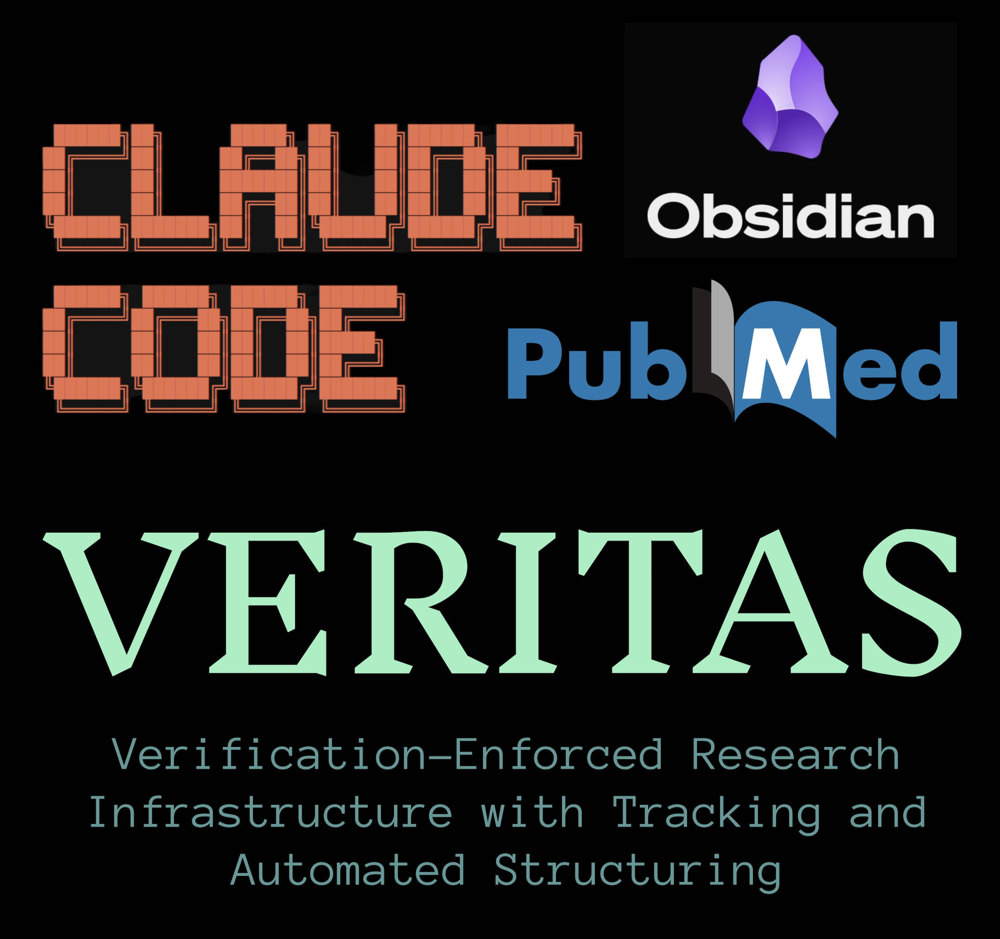

<p align="center">
  
</p>

# VERITAS
Verification-Enforced Research Infrastructure with Tracking and Automated Structuring

A Claude Code research framework that enforces citation compliance, validates scientific claims in real-time, and automatically structures your knowledge base.

## Table of Contents

- [About VERITAS](#about-veritas)
- [What Makes VERITAS Different](#what-makes-veritas-different)
- [System Architecture](#system-architecture)
- [Quick Start](#quick-start)
- [Core Features](#core-features)
- [System Components](#system-components)
- [Documentation](#documentation)
- [Example Workflow](#example-workflow)
- [Requirements](#requirements)
- [Installation](#installation)
- [Troubleshooting](#troubleshooting)
- [Contributing](#contributing)
- [License](#license)

## About VERITAS

VERITAS embodies the core principle of truth in research. Every claim must be verified, every source must be cited, and every process is tracked to maintain complete research integrity.

- **Verification-Enforced** - Active enforcement of citation requirements through hooks and compliance checks
- **Research Infrastructure** - Complete framework providing a professional research environment
- **Tracking and Automated Structuring** - Intelligent organization and documentation of all research activities

**GitHub**: https://github.com/VMWM/VERITAS

## What Makes VERITAS Different

Unlike other research tools, VERITAS provides:

1. **Real-time Citation Enforcement** - Claims without PMIDs are automatically flagged and blocked
2. **Multi-layer Validation** - Pre-command, during execution, and post-command checks ensure compliance
3. **Domain Expert System** - Customizable templates for any research field
4. **Integrated Knowledge Graph** - Automatic entity extraction and relationship mapping
5. **Professional Templates** - Grant-ready research questions and concept notes out of the box

## System Architecture

```
User Message → Pre-Command Hooks → Claude Processes → Tool Calls → Post-Validation → Response
                    ↓                      ↓                            ↓
              (Shows reminders)    (Reads CLAUDE.md)         (Checks what was created)
                    ↓                      ↓                            ↓
              (Sets env vars)     (Follows instructions)    (Logs violations & reports)
```

This multi-checkpoint architecture ensures research integrity at every step.

## Quick Start

### 30-Second Installation

```bash
# Clone and install
git clone https://github.com/VMWM/VERITAS.git
cd VERITAS
./setup.sh

# Configure Claude
./scripts/setup/configure-claude.sh

# Restart Claude and test
```

### First Use

Start a new Claude Code conversation and try:
```
"What is your role according to CLAUDE.md?"
```

Claude should respond with awareness of the VERITAS system and its research capabilities.

## Core Features

### Research Management
- **Literature Reviews** - Automatic PubMed citation verification (35+ million articles)
- **Research Questions** - Structured templates for grant applications
- **Concept Notes** - Wiki-linked knowledge base with validation
- **Daily Journals** - Automatic progress tracking and summarization

### Quality Enforcement
- **Citation Validation** - Every claim requires (Author et al., Year, PMID: XXXXXXXX)
- **Format Compliance** - Tables, headers, and links follow strict standards
- **Output Verification** - Post-execution checks ensure all content meets requirements

### Knowledge Integration
- **Memory MCP** - Persistent knowledge graph for entities and relationships
- **Obsidian Vaults** - Direct integration with your research notes
- **Session Tracking** - Automatic conversation logging with 5-day retention

## System Components

### MCP Servers (7 integrated)

1. **Sequential Thinking** - Task decomposition and planning
2. **PubMed** - Citation search and verification
3. **Memory** - Knowledge graph storage
4. **Filesystem** - Project file access
5. **Obsidian REST (Primary)** - Main vault operations
6. **Obsidian REST (Journal)** - Journal vault operations
7. **Conversation Logger** - Session tracking (custom-built, included)

### Enforcement System

- **Pre-command hooks** - Display requirements before execution
- **Task router** - Intelligent task detection and routing
- **Compliance validator** - Blocks incorrect tool usage
- **Post-command validator** - Verifies output compliance

### Templates & Configuration

```
VERITAS/
├── setup.sh                   # One-click installer
├── .claude/                   # Working configuration
│   ├── agents/               # Domain expert configuration
│   ├── hooks/                # Validation and enforcement
│   └── config/               # System settings
├── templates/                 # User customization
│   ├── agents/               # Domain expert examples
│   ├── obsidian/             # Note templates
│   └── claude.md             # Constitution template
└── docs/                      # Complete documentation
```

## Documentation

### Getting Started
- **[Installation Guide](docs/getting-started.md)** - Complete setup walkthrough
- **[Quick Reference](docs/quick_reference.md)** - Command cheat sheet
- **[Functional Tests](tests/veritas-functional-test.md)** - Verify your setup

### Configuration
- **[Obsidian Integration](docs/obsidian-integration.md)** - Connect your research vault
- **[Customization Guide](docs/customization.md)** - Adapt for your research domain
- **[Domain Expert Templates](templates/agents/README.md)** - Field-specific configurations

### Troubleshooting
- **[Troubleshooting Guide](docs/troubleshooting.md)** - Common issues and solutions
- **[MCP Server Reference](docs/reference/mcp-servers.md)** - Technical specifications

## Example Workflow

### Creating a Research Question

```
You: "Create a research question about machine learning in medical diagnosis"

VERITAS automatically:
1. Starts with sequential thinking for planning
2. Searches PubMed for relevant literature
3. Extracts key entities to knowledge graph
4. Creates formatted note in Research Questions/
5. Generates linked concept pages
6. Validates all citations have PMIDs
7. Reports compliance status
```

### Result Structure

```markdown
# How Does Machine Learning Improve Medical Diagnosis

## Direct Answer
Machine learning significantly enhances diagnostic accuracy...
(Smith et al., 2023, PMID: 37654321) [ABSTRACT-VERIFIED]

## Key Findings
- 92% accuracy improvement in radiology (Jones et al., 2024, PMID: 38765432)
- Reduced false positives by 45% (Chen et al., 2023, PMID: 37890123)

## Knowledge Gaps
- Limited validation in diverse populations
- Interpretability challenges remain unresolved

## Grant Applications
**Significance**: Addresses critical diagnostic errors...
**Innovation**: Novel approach combining...
**Approach**: Three-phase validation study...

## References
1. Smith J, et al. (2023). Machine Learning in Medicine. PMID: 37654321
2. Jones K, et al. (2024). AI Radiology Applications. PMID: 38765432

## Related Concepts
- [[Machine_Learning]]
- [[Medical_Diagnosis]]
- [[Diagnostic_Accuracy]]
```

## Requirements

### Software
- **Claude Desktop** (Claude Code) with API access
- **Node.js** v16+ and npm
- **Python** 3.8+
- **Git**
- **Obsidian** (optional but recommended)

### Quick Check
```bash
# Verify prerequisites
command -v node && echo "Node.js: OK" || echo "Node.js: MISSING"
command -v python3 && echo "Python: OK" || echo "Python: MISSING"
command -v git && echo "Git: OK" || echo "Git: MISSING"
```

## Installation

### Standard Installation

1. **Clone and Setup**
   ```bash
   git clone https://github.com/VMWM/VERITAS.git
   cd VERITAS
   ./setup.sh
   ```

2. **Configure Claude**
   ```bash
   ./scripts/setup/configure-claude.sh
   # Choose: Option 1 (merge) → Option 1 (separate configs)
   ```

3. **Restart Claude Desktop**

4. **Test Your Setup**
   - Start new Claude conversation
   - Try prompts from `tests/veritas-functional-test.md`

### Automated Installation

Copy this prompt into Claude Code for automatic setup:

```
Install VERITAS from https://github.com/VMWM/VERITAS.git:
1. Clone to ~/VERITAS
2. Run ./setup.sh with my current directory as project
3. Run ./scripts/setup/configure-claude.sh (merge → separate)
4. Remind me to restart Claude Desktop
```

## Troubleshooting

### Common Issues

| Issue | Solution |
| --- | --- |
| "MCP server not found" | Restart Claude Desktop completely |
| "Cannot connect to vault" | Check Obsidian Local REST API plugin is running |
| "No citations found" | Verify PubMed MCP is configured correctly |
| "Hooks not running" | Source environment: `source .claude/env.sh` |

### Getting Help

1. Check **[Troubleshooting Guide](docs/troubleshooting.md)**
2. Review **[Functional Tests](tests/veritas-functional-test.md)**
3. Open an [issue on GitHub](https://github.com/VMWM/VERITAS/issues)

## Contributing

We welcome contributions! Priority areas:

- **Domain Templates** - Share your field-specific configurations
- **MCP Integrations** - Connect additional research tools
- **Documentation** - Improve guides and examples
- **Bug Reports** - Help us improve stability

Submit PRs to: https://github.com/VMWM/VERITAS

## License

MIT License - See [license](license) file for details

## Acknowledgments

- Built for the Claude Code research community
- Powered by MCP (Model Context Protocol) by Anthropic
- Inspired by scientific best practices
- Special thanks to all contributors and beta testers

---

**Ready to transform your research workflow?** Get started with VERITAS today!