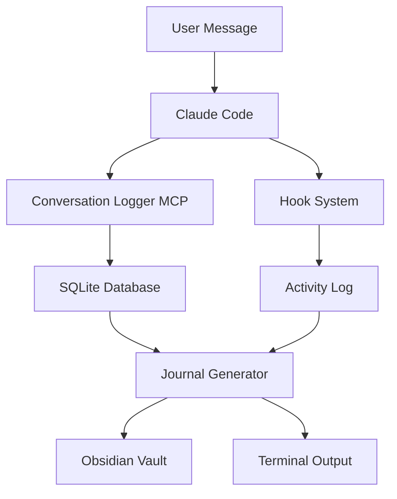
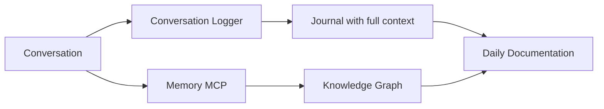

# Conversation Logger MCP - Complete Documentation

## Table of Contents
1. [Overview](#overview)
2. [Architecture](#architecture)
3. [Installation & Setup](#installation--setup)
4. [Core Features](#core-features)
5. [MCP Tools Reference](#mcp-tools-reference)
6. [Journal Generation](#journal-generation)
7. [Database Schema](#database-schema)
8. [Usage Examples](#usage-examples)
9. [Integration Workflows](#integration-workflows)
10. [Troubleshooting](#troubleshooting)
11. [Advanced Configuration](#advanced-configuration)
12. [API Reference](#api-reference)

---

## Overview

The Conversation Logger MCP Server provides persistent conversation memory for Claude Code, addressing a critical gap in the ecosystem. Unlike Memory MCP which extracts concepts and relationships, the Conversation Logger captures complete conversation transcripts, enabling accurate journal generation and activity tracking.

### Key Differentiators

| Feature | Memory MCP | Conversation Logger |
|---------|------------|-------------------|
| **Data Type** | Knowledge graph (entities/relations) | Full conversation transcripts |
| **Storage** | Concepts and observations | Complete messages with metadata |
| **Purpose** | Knowledge extraction | Activity tracking & documentation |
| **Journal Generation** | Cannot (lacks raw data) | Full support with templates |
| **Persistence** | Cross-session concepts | Cross-session conversations |

### Why It Exists

This tool was created to provide MemoriPilot-like functionality for Claude Code users who need:
- Persistent memory across coding sessions
- Accurate daily journal generation from conversation history
- Activity tracking for research documentation
- Project context awareness
- Integration with existing knowledge management systems (Obsidian)

---

## Architecture

### System Components

```
conversation-logger/
├── index.js                    # Main MCP server implementation
├── obsidian-journal-generator.js # Journal generation engine
├── configure.sh                # Manual configuration script
├── package.json                # Dependencies and metadata
└── README.md                   # Quick reference guide

~/.conversation-logger/
└── conversations.db            # SQLite database (auto-created)

~/.claude/hooks/
├── conversation-logger-hook.js # Activity tracking hook
└── activity.log               # Activity log file
```

### Data Flow



### Integration Points

1. **MCP Protocol**: Direct integration with Claude Code via stdio transport
2. **Hook System**: Captures events through Claude's hook infrastructure
3. **SQLite Database**: Persistent storage with structured schema
4. **Obsidian REST API**: Direct posting to research journals
5. **Memory MCP**: Complementary knowledge graph integration

---

## Installation & Setup

### Prerequisites

- Node.js v16+ and npm
- Claude Code with MCP support
- SQLite3 (usually pre-installed on macOS/Linux)
- Optional: Obsidian with Local REST API plugin

### Automatic Installation

The conversation logger is automatically installed when running the main setup script:

```bash
git clone https://github.com/VMWM/HLA_Agent-MCP_System.git
cd HLA_Agent-MCP_System
./setup.sh
```

This process:
1. Installs npm dependencies in `conversation-logger/`
2. Creates database directory at `~/.conversation-logger/`
3. Configures MCP server in Claude's user config
4. Sets up helper scripts in `~/bin/`
5. Initializes the SQLite database

### Manual Installation

For standalone installation or troubleshooting:

```bash
# Install dependencies
cd conversation-logger
npm install

# Run configuration script
./configure.sh

# Verify installation
claude mcp list | grep conversation-logger
```

### Verification

After installation, verify the system is working:

```bash
# Check MCP connection
claude mcp list

# Expected output:
# conversation-logger: node /path/to/index.js - ✓ Connected

# Check database creation
ls -la ~/.conversation-logger/
# Should show conversations.db

# Test journal generation (after using Claude Code)
generate-journal
```

---

## Core Features

### 1. Persistent Conversation Memory

**What it does**: Maintains complete conversation history across all Claude Code sessions.

**How it works**:
- Each Claude Code session gets a unique UUID
- All messages are timestamped and stored
- Database persists between sessions
- Project context is preserved

**Benefits**:
- Never lose important conversations
- Track progress across days/weeks
- Generate accurate historical reports
- Maintain context for long-term projects

### 2. Activity Tracking

**What it does**: Monitors and categorizes user activities beyond just messages.

**Tracked events**:
- User prompts and intents
- Tool usage (which tools, when, how often)
- File modifications (what changed, when)
- Session boundaries and durations
- Project switches

**Intent extraction categories**:
- `create`: Building new features/files
- `fix`: Debugging and repairs
- `modify`: Refactoring and updates
- `analyze`: Code review and investigation
- `explain`: Documentation and learning
- `test`: Validation and verification
- `search`: Finding code/information
- `journal`: Documentation generation

### 3. Automatic Journal Generation

**What it does**: Creates comprehensive daily research logs from conversation data.

**Journal sections**:
- Session Summary (duration, focus areas)
- Technical Implementations (what was built)
- Research Insights (discoveries, learnings)
- Problems Solved (issues and resolutions)
- Session Metrics (quantitative data)
- Next Actions (TODOs extracted)
- References (links to resources)

**Format options**:
- Markdown for Obsidian
- Plain text for terminals
- JSON for programmatic access

### 4. Multi-Project Awareness

**What it does**: Tracks work across different projects in a single database.

**Features**:
- Project path stored with each session
- Cross-project journal generation
- Project-specific statistics
- Context switching detection

### 5. Tool Integration

**What it does**: Provides MCP tools that Claude can use programmatically.

**Available tools**:
- `log_message`: Record conversations
- `log_activity`: Track specific events
- `generate_journal`: Create journal entries
- `get_session_stats`: View statistics
- `start_new_session`: Begin new tracking

---

## MCP Tools Reference

### log_message

Records a conversation message with full context.

**Parameters**:
```javascript
{
  role: "user" | "assistant" | "system",
  content: string,
  tools_used?: string[],      // Optional: tools called
  files_modified?: string[]    // Optional: files changed
}
```

**Example usage** (by Claude):
```javascript
await log_message({
  role: "assistant",
  content: "Created new React component",
  tools_used: ["Write", "Edit"],
  files_modified: ["src/components/NewFeature.jsx"]
});
```

### log_activity

Records a specific activity or event.

**Parameters**:
```javascript
{
  activity_type: string,
  description: string,
  metadata?: object    // Optional: additional data
}
```

**Activity types**:
- `implementation`: Code creation
- `debugging`: Problem solving
- `refactoring`: Code improvement
- `documentation`: Writing docs
- `configuration`: Setup tasks
- `problem_solved`: Issue resolution

**Example usage**:
```javascript
await log_activity({
  activity_type: "problem_solved",
  description: "Fixed React re-rendering issue",
  metadata: {
    component: "UserDashboard",
    solution: "Added useMemo hook",
    time_spent: "45 minutes"
  }
});
```

### generate_journal

Creates a formatted journal entry.

**Parameters**:
```javascript
{
  date?: string    // Optional: YYYY-MM-DD format, defaults to today
}
```

**Example usage**:
```javascript
// Generate today's journal
await generate_journal();

// Generate for specific date
await generate_journal({ date: "2025-01-24" });
```

**Returns**: Formatted markdown journal entry

### get_session_stats

Retrieves statistics about logged sessions.

**Parameters**: None

**Returns**:
```javascript
{
  currentSessionId: "uuid-here",
  sessionStartTime: "2025-01-24T10:30:00Z",
  todaySessions: { count: 3 },
  todayMessages: { count: 45 },
  totalSessions: { count: 127 },
  totalMessages: { count: 3421 }
}
```

### start_new_session

Manually starts a new logging session.

**Parameters**: None

**Use cases**:
- Switching between major tasks
- Starting a new project context
- Resetting after a break

**Returns**: New session UUID

---

## Journal Generation

### Default Template Structure

The journal generator creates entries following this structure:

```markdown
# Daily Research Log: YYYY-MM-DD

## Session Summary
**Total Sessions**: N
**Primary Focus**: [Extracted topics]
**Total Duration**: X hours

---

## Technical Implementations

### Session [ID]
- Implementation details
- Code created
- Features added

## Research Insights & Discoveries

### Key Learning
[Extracted insights from conversations]

## Problems Solved

### Issue Title
**Problem**: Description
**Solution**: How it was resolved

## Session Metrics

| Metric | Value | Notes |
|--------|-------|-------|
| Total Messages | N | User + Assistant |
| Activities Logged | N | |
| Files Modified | N | Unique files |
| Tools Used | N | Unique tools |

## Next Actions

### Immediate
- TODO items extracted from conversation

## References
- Memory MCP Database: `~/.nova-global/memory.db`
- Conversation Logs: `~/.conversation-logger/conversations.db`
- Previous day: [[YYYY-MM-DD]]
- Next day: [[YYYY-MM-DD]]

---

*Generated: [timestamp]*
*Conversation Logger MCP + Claude Code*
```

### Customizing Journal Format

You can customize the journal format by modifying `obsidian-journal-generator.js`:

```javascript
// In generateEnhancedJournal() method
async generateEnhancedJournal(date = null) {
  // Modify sections here
  let journal = `# Your Custom Title: ${targetDate}\n\n`;
  
  // Add custom sections
  journal += `## Custom Section\n`;
  journal += await this.extractCustomData(sessions);
  
  return journal;
}
```

### Posting to Obsidian

The journal generator can post directly to Obsidian vaults:

```bash
# Manual posting
generate-journal --post

# Automatic daily posting (via cron)
0 23 * * * ~/bin/generate-journal --post
```

Configuration for Obsidian:
- Default port: 27125 (Research Journal vault)
- Path: `/vault/Daily/YYYY-MM-DD.md`
- Format: Markdown with wiki links

---

## Database Schema

### Tables Overview

The SQLite database uses three main tables:

### sessions Table

Tracks individual Claude Code sessions.

```sql
CREATE TABLE sessions (
  id TEXT PRIMARY KEY,           -- UUID
  start_time DATETIME DEFAULT CURRENT_TIMESTAMP,
  end_time DATETIME,            -- NULL if session active
  project_path TEXT,             -- Working directory
  summary TEXT                   -- Optional session summary
);
```

### messages Table

Stores all conversation messages.

```sql
CREATE TABLE messages (
  id INTEGER PRIMARY KEY AUTOINCREMENT,
  session_id TEXT,               -- Foreign key to sessions
  timestamp DATETIME DEFAULT CURRENT_TIMESTAMP,
  role TEXT,                     -- user/assistant/system
  content TEXT,                  -- Message content
  tools_used TEXT,               -- JSON array of tools
  files_modified TEXT,           -- JSON array of files
  FOREIGN KEY (session_id) REFERENCES sessions (id)
);
```

### activities Table

Records specific activities and events.

```sql
CREATE TABLE activities (
  id INTEGER PRIMARY KEY AUTOINCREMENT,
  session_id TEXT,               -- Foreign key to sessions
  timestamp DATETIME DEFAULT CURRENT_TIMESTAMP,
  activity_type TEXT,            -- Type of activity
  description TEXT,              -- Activity description
  metadata TEXT,                 -- JSON metadata
  FOREIGN KEY (session_id) REFERENCES sessions (id)
);
```

### Database Location

- Path: `~/.conversation-logger/conversations.db`
- Format: SQLite3
- Size: Grows ~1MB per 1000 messages
- Backup: Recommended weekly

### Direct Database Access

For advanced queries:

```bash
# Open database
sqlite3 ~/.conversation-logger/conversations.db

# Example queries
.tables
SELECT COUNT(*) FROM messages WHERE role = 'user';
SELECT * FROM sessions WHERE date(start_time) = date('now');
```

---

## Usage Examples

### Example 1: Research Day Workflow

```bash
# Morning: Start research on new topic
# Claude Code automatically starts logging

# Work on multiple files, use various tools
# All tracked automatically

# Afternoon: Switch projects
cd ~/another-project
# Conversation logger maintains context

# Evening: Generate journal
generate-journal

# Review and post to Obsidian
generate-journal --post
```

### Example 2: Debugging Session Tracking

```javascript
// In Claude Code conversation
"I'm debugging a memory leak in the React app"

// Claude uses tools, modifies files
// All automatically logged with:
// - Intent: "fix"
// - Activity type: "debugging"
// - Files modified: [list]
// - Tools used: [list]

// Later, retrieve this specific session
"Show me all debugging sessions this week"
```

### Example 3: Weekly Report Generation

```bash
# Generate reports for entire week
for date in $(seq 0 6); do
  day=$(date -v-${date}d +%Y-%m-%d)
  generate-journal $day > weekly/$day.md
done

# Combine into single report
cat weekly/*.md > weekly-report.md
```

### Example 4: Project-Specific Analysis

```sql
-- Find all sessions for specific project
sqlite3 ~/.conversation-logger/conversations.db << SQL
SELECT 
  date(start_time) as date,
  COUNT(DISTINCT s.id) as sessions,
  COUNT(m.id) as messages
FROM sessions s
JOIN messages m ON s.id = m.session_id
WHERE s.project_path LIKE '%HLA_Agent%'
GROUP BY date(start_time)
ORDER BY date DESC;
SQL
```

---

## Integration Workflows

### With Memory MCP

The Conversation Logger complements Memory MCP:



**Best practices**:
1. Use Memory MCP for concept extraction
2. Use Conversation Logger for activity tracking
3. Combine both in journal generation
4. Cross-reference entities with conversations

### With Obsidian

**Setup**:
1. Install Obsidian Local REST API plugin
2. Configure bearer token
3. Set port to 27125 for journal vault
4. Create Daily/ folder structure

**Workflow**:
```bash
# Generate and review locally
generate-journal > temp.md
# Edit if needed
vim temp.md
# Post to Obsidian
curl -X POST https://localhost:27125/vault/Daily/$(date +%Y-%m-%d).md \
  -H "Authorization: Bearer YOUR_TOKEN" \
  -H "Content-Type: text/markdown" \
  --data-binary @temp.md
```

### With Git Repositories

Track your research in version control:

```bash
# Add journal generation to git hooks
cat > .git/hooks/post-commit << 'EOF'
#!/bin/bash
generate-journal >> project-journal.md
git add project-journal.md
git commit --amend --no-edit
EOF
chmod +x .git/hooks/post-commit
```

---

## Troubleshooting

### Common Issues and Solutions

#### 1. MCP Server Not Connecting

**Symptoms**: 
- Server shows as disconnected in `claude mcp list`
- Tools not available in Claude Code

**Solutions**:
```bash
# Check if installed
ls -la conversation-logger/node_modules

# Reinstall dependencies
cd conversation-logger
npm install

# Reconfigure MCP
./configure.sh

# Restart Claude Code
```

#### 2. Database Not Creating

**Symptoms**:
- No conversations.db file
- Journal generation fails

**Solutions**:
```bash
# Create directory manually
mkdir -p ~/.conversation-logger

# Check permissions
ls -la ~/.conversation-logger

# Initialize database manually
node -e "
const Database = require('sqlite3');
const db = new Database.Database('$HOME/.conversation-logger/conversations.db');
console.log('Database created');
"
```

#### 3. Journal Not Generating

**Symptoms**:
- `generate-journal` returns empty
- No sessions found message

**Solutions**:
```bash
# Check if sessions exist
sqlite3 ~/.conversation-logger/conversations.db \
  "SELECT COUNT(*) FROM sessions;"

# Check today's sessions
sqlite3 ~/.conversation-logger/conversations.db \
  "SELECT * FROM sessions WHERE date(start_time) = date('now');"

# Force session creation
# Use any MCP tool in Claude Code to trigger logging
```

#### 4. Obsidian Integration Failing

**Symptoms**:
- Journal not posting to vault
- Connection refused errors

**Solutions**:
```bash
# Test Obsidian REST API
curl -k https://localhost:27125/vault/ \
  -H "Authorization: Bearer YOUR_TOKEN"

# Check port configuration
# Should be 27125 for journal vault

# Verify SSL settings
# May need -k flag for self-signed certificates
```

#### 5. Missing Helper Scripts

**Symptoms**:
- `generate-journal: command not found`
- `session-stats: command not found`

**Solutions**:
```bash
# Add ~/bin to PATH
echo 'export PATH="$HOME/bin:$PATH"' >> ~/.zshrc
source ~/.zshrc

# Or run configuration script
cd conversation-logger
./configure.sh
```

### Debug Mode

Enable debug logging for troubleshooting:

```javascript
// In index.js, add at top:
const DEBUG = process.env.DEBUG === 'true';

function debug(message) {
  if (DEBUG) console.error(`[DEBUG] ${message}`);
}

// Then use throughout:
debug(`Session started: ${this.currentSessionId}`);
```

Run with debug:
```bash
DEBUG=true generate-journal
```

---

## Advanced Configuration

### Environment Variables

Configure behavior via environment:

```bash
# In ~/.zshrc or ~/.bashrc
export CONVERSATION_LOGGER_DB="$HOME/.conversation-logger/conversations.db"
export OBSIDIAN_API_TOKEN="your-token-here"
export OBSIDIAN_API_URL="https://127.0.0.1:27125"
export JOURNAL_FORMAT="markdown"  # or "json", "text"
export AUTO_POST_JOURNAL="true"   # Auto-post to Obsidian
```

### Custom Hooks

Add custom processing to events:

```javascript
// In ~/.claude/hooks/custom-logger.js
module.exports = {
  onMessage: async (message) => {
    // Custom processing
    if (message.content.includes('IMPORTANT')) {
      await markAsImportant(message);
    }
  },
  
  onSessionEnd: async (sessionId) => {
    // Auto-generate journal
    await generateJournal();
  }
};
```

### Database Maintenance

Keep your database optimized:

```bash
# Backup database
cp ~/.conversation-logger/conversations.db \
   ~/.conversation-logger/backup-$(date +%Y%m%d).db

# Vacuum to reclaim space
sqlite3 ~/.conversation-logger/conversations.db "VACUUM;"

# Archive old sessions (older than 90 days)
sqlite3 ~/.conversation-logger/conversations.db << SQL
DELETE FROM messages 
WHERE session_id IN (
  SELECT id FROM sessions 
  WHERE date(start_time) < date('now', '-90 days')
);
DELETE FROM sessions 
WHERE date(start_time) < date('now', '-90 days');
VACUUM;
SQL
```

### Performance Tuning

For large databases:

```sql
-- Add indexes for common queries
CREATE INDEX idx_messages_session ON messages(session_id);
CREATE INDEX idx_messages_timestamp ON messages(timestamp);
CREATE INDEX idx_sessions_start ON sessions(start_time);
CREATE INDEX idx_activities_type ON activities(activity_type);
```

---

## API Reference

### JavaScript API

For programmatic access from other tools:

```javascript
const ConversationLogger = require('./conversation-logger');

// Initialize
const logger = new ConversationLogger();
await logger.initialize();

// Log message
await logger.logMessage('user', 'Hello world', ['Tool1'], ['file.js']);

// Generate journal
const journal = await logger.generateJournal('2025-01-24');

// Get statistics
const stats = await logger.getSessionStats();
```

### REST API (Future)

Planned REST API endpoints:

```yaml
GET /api/sessions
  - List all sessions
  - Query params: date, project, limit

GET /api/sessions/:id
  - Get specific session with messages

POST /api/messages
  - Log a new message

GET /api/journal/:date
  - Generate journal for date

GET /api/stats
  - Get statistics
```

### Database API

Direct SQL access for analysis:

```python
import sqlite3
import json

# Connect to database
conn = sqlite3.connect(
    '/Users/you/.conversation-logger/conversations.db'
)

# Get today's messages
cursor = conn.execute("""
    SELECT m.*, s.project_path
    FROM messages m
    JOIN sessions s ON m.session_id = s.id
    WHERE date(m.timestamp) = date('now')
    ORDER BY m.timestamp
""")

# Process messages
for row in cursor:
    message = {
        'role': row[3],
        'content': row[4],
        'tools': json.loads(row[5] or '[]')
    }
    print(message)
```

---

## Best Practices

### 1. Regular Journal Generation
- Generate daily journals at consistent times
- Review before posting to Obsidian
- Archive journals weekly/monthly

### 2. Session Management
- Start new sessions for major context switches
- Use meaningful activity descriptions
- Tag important conversations

### 3. Database Maintenance
- Weekly backups
- Monthly vacuuming
- Quarterly archiving of old data

### 4. Integration Strategy
- Combine with Memory MCP for complete picture
- Use with version control for project documentation
- Integrate with task management systems

### 5. Privacy Considerations
- Database contains full conversation history
- Not included in git repositories (via .gitignore)
- Consider encryption for sensitive projects

---

## Future Enhancements

Planned features for future versions:

1. **Working Modes** (like MemoriPilot)
   - Research mode
   - Coding mode
   - Debug mode
   - Review mode

2. **Advanced Analytics**
   - Productivity metrics
   - Learning curves
   - Pattern detection
   - Time tracking

3. **Export Formats**
   - PDF reports
   - CSV exports
   - JSON dumps
   - HTML dashboards

4. **Team Collaboration**
   - Shared databases
   - Multi-user support
   - Permission systems
   - Merge capabilities

5. **AI Enhancements**
   - Smart summarization
   - Automatic tagging
   - Insight extraction
   - Trend analysis

---

## Contributing

We welcome contributions! Areas where help is needed:

- Additional journal templates
- Integration with other tools
- Performance optimizations
- Documentation improvements
- Bug fixes and testing

Submit issues and PRs to: https://github.com/VMWM/HLA_Agent-MCP_System

---

## Support

For help and support:

- **GitHub Issues**: [Report bugs or request features](https://github.com/VMWM/HLA_Agent-MCP_System/issues)
- **Documentation**: This guide and README files
- **Community**: Claude Code Discord channels

---

*Last updated: January 2025*
*Version: 1.0.0*