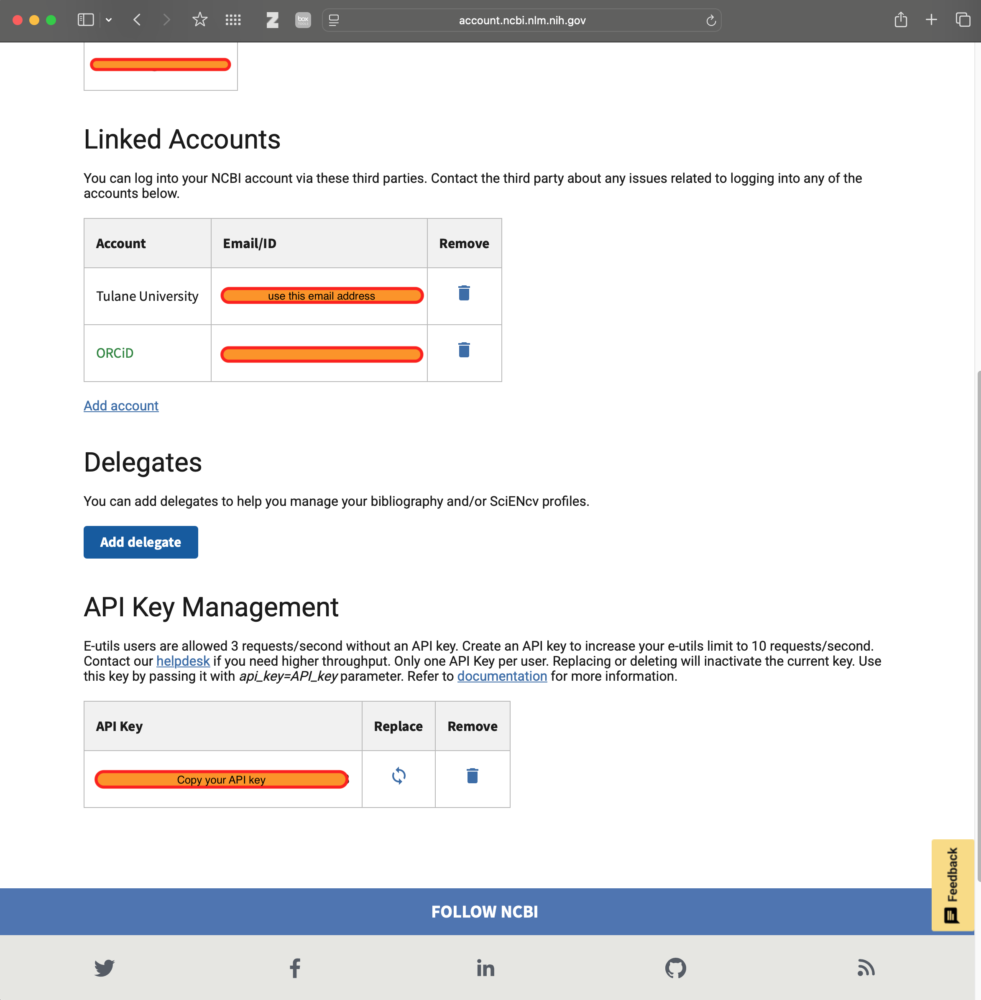

# PubMed MCP Setup Instructions

## Overview

VERITAS now uses the `@ncukondo/pubmed-mcp` server for PubMed integration instead of the problematic `pubmed-cyanheads` server. This change resolves the PMID string/number conversion issue.

## Requirements

### 1. NCBI Credentials (REQUIRED)

You must have:

- An email address to register with NCBI
- An NCBI API key (recommended for better performance)

### 2. Getting Your NCBI API Key

1. Go to https://www.ncbi.nlm.nih.gov/account/settings/
2. Sign in or create an NCBI account
3. Navigate to "API Key Management" section
4. Click "Create an API Key" or copy your existing key
5. Save this key securely - you'll need it for configuration


*Screenshot showing the NCBI account settings page with API Key Management section and linked accounts*

## Installation Steps

### Step 1: Install the PubMed MCP Server

```bash
npm install -g @ncukondo/pubmed-mcp
```

### Step 2: Configure Claude Desktop

Add the following to your `claude_desktop_config.json` file:

```json
"pubmed": {
  "command": "npx",
  "args": [
    "@ncukondo/pubmed-mcp"
  ],
  "env": {
    "PUBMED_EMAIL": "YOUR_EMAIL@example.com",
    "PUBMED_API_KEY": "YOUR_NCBI_API_KEY",
    "PUBMED_CACHE_DIR": "/tmp/pubmed-cache",
    "PUBMED_CACHE_TTL": "86400"
  }
}
```

**IMPORTANT**: Replace `YOUR_EMAIL@example.com` and `YOUR_NCBI_API_KEY` with your actual credentials.

### Step 3: Remove Old PubMed Server (if present)

If you have the old `pubmed-cyanheads` server configured, remove or comment it out:

```json
// Remove or comment out this section:
// "pubmed-cyanheads": {
//   "command": "npx",
//   "args": ["@cyanheads/pubmed-mcp-server"],
//   ...
// }
```

### Step 4: Restart Claude

After making configuration changes, restart Claude Desktop to load the new MCP server.

## Verification

After restarting Claude, verify the setup:

1. Check that `pubmed` shows as "connected" in the MCP server list
2. Test with a simple query like searching for a PMID

## Benefits of This Configuration

- **Higher Rate Limits**: With an API key, you get 10 requests/second (vs 3 without)
- **Caching**: 24-hour cache reduces redundant API calls
- **Reliability**: Fixes the PMID type conversion issue
- **NCBI Compliance**: Proper email registration follows NCBI guidelines

## Troubleshooting

If the server fails to connect:

1. Verify your email is correctly formatted
2. Check that your API key is valid (test at https://www.ncbi.nlm.nih.gov/account/)
3. Ensure npm packages are properly installed
4. Check Claude logs for specific error messages

## Security Notes

- Never commit your API key or email to public repositories
- Use environment variables or secure credential storage for production
- The template configuration uses placeholders that must be replaced
